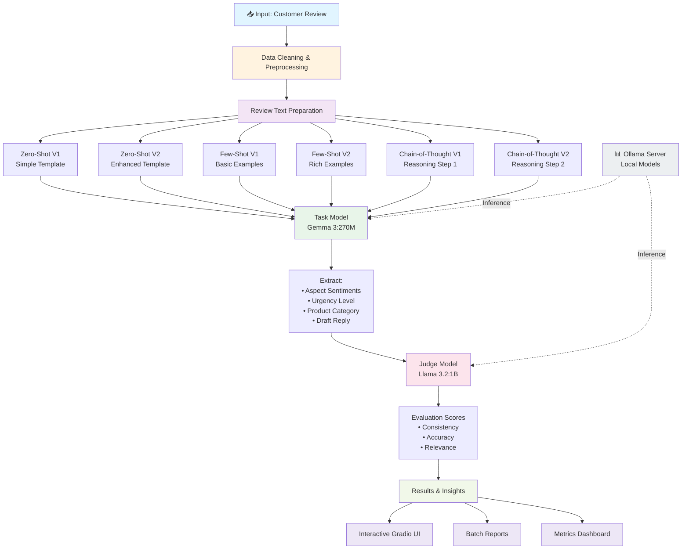
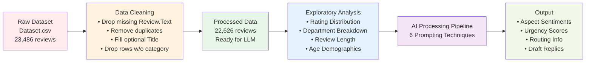

# Real-Time Retail Feedback Intelligence 🛍️

<div align="center">
  

---

## 📋 Table of Contents

- [Business Context](#business-context)
- [Project Objective](#project-objective)
- [Architecture](#architecture)
- [Dataset](#dataset)
- [Installation &amp; Setup](#installation--setup)
- [Key Features](#key-features)
- [Prompting Techniques](#prompting-techniques)
- [Project Structure](#project-structure)
- [Usage](#usage)
- [Results &amp; Evaluation](#results--evaluation)
- [Technical Stack](#technical-stack)

---

## 🎯 Business Context

### The Problem

**ChicStyle**, a fast-growing fashion retailer, receives **thousands of customer reviews per hour** during holiday and festive sales spikes. These reviews are:

- **Unstructured free text** with no consistent format
- **Mixed opinions** in a single sentence (e.g., "fit is great but color is wrong")
- **Aspect-specific feedback** that traditional NLP cannot separate
- **Urgent and critical** — delayed responses cost trust, refunds, and negative word-of-mouth

### Why This Matters

- **Scale Problem**: Manual triage of thousands of reviews per hour is impossible
- **Accuracy Problem**: Traditional rule-based/ML classifiers can only predict overall sentiment (Positive/Negative/Neutral), missing nuanced aspect-level opinions
- **Urgency Problem**: The system cannot distinguish between "Nice color" and "BROKEN ZIPPER" — both need different response priorities
- **Business Impact**: Every delayed complaint during peak sales directly translates into lost customer trust and reduced repeat purchases

---

## 🎯 Project Objective

Build a **Generative-AI-powered feedback intelligence pipeline** that:

1. **Detects sentiment per aspect** (fit, color, quality, delivery, etc.) — not just overall sentiment
2. **Classifies urgency levels** (Critical/High/Medium/Low) to prioritize human review
3. **Identifies product categories** (department, class, division)
4. **Evaluates prompt engineering techniques** using an **LLM-as-judge** framework to compare:
   - Zero-Shot (V1 baseline, V2 enhanced)
   - Few-Shot (V1 baseline, V2 enhanced)
   - Chain-of-Thought (V1 baseline, V2 enhanced)
5. **Auto-drafts personalized replies** based on sentiment and urgency
6. **Summarizes batch reviews** into actionable reports for product teams
7. **Exposes the pipeline** via an interactive **Gradio web app** for non-technical business users

---

## 🏗️ Architecture




## 📊 Data Pipeline




## 📈 Dataset

### Source

**Women's E-Commerce Clothing Reviews** dataset (`Dataset.csv`)

### Characteristics

| Metric                      | Value                                                                                                                 |
| --------------------------- | --------------------------------------------------------------------------------------------------------------------- |
| **Original Records**  | 23,486 reviews                                                                                                        |
| **Processed Records** | 22,626 reviews                                                                                                        |
| **Columns**           | 10 (Clothing ID, Age, Title, Review Text, Rating, Recommended Indicator, Feedback Count, Division, Department, Class) |
| **Time Period**       | Historical e-commerce data                                                                                            |
| **Data Format**       | Semi-colon delimited CSV                                                                                              |

### Key Columns

| Column              | Type          | Purpose                                                      |
| ------------------- | ------------- | ------------------------------------------------------------ |
| `Review.Text`     | String        | Primary input for LLM pipeline (sentiment, urgency, aspects) |
| `Rating`          | Integer (1-5) | Proxy ground truth for sanity-checking sentiment predictions |
| `Recommended.IND` | Binary (0/1)  | Proxy ground truth for recommendation predictions            |
| `Division.Name`   | String        | Product division (Intimates, General, General Petite)        |
| `Department.Name` | String        | Product department (Tops, Dresses, Bottoms, Jackets, etc.)   |
| `Class.Name`      | String        | Product class for fine-grained routing                       |
| `Age`             | Integer       | Customer demographic (not used in LLM, for analysis only)    |

### Data Quality

```
Duplicate rows removed:                 21
Missing Review.Text (dropped):          845
Missing Title (filled as empty):        3,810
Missing product category (dropped):     14
Final dataset size:                     22,626 reviews
```

## 🚀 Installation & Setup

### Prerequisites

* **Python 3.12+**
* **Ollama** (for local model hosting)
* **4GB+ RAM** (minimum; 8GB+ recommended)

### Step 1: Install Ollama

Download and install Ollama from [https://ollama.com/download](https://ollama.com/download)

### Step 2: Pull Models

```Shell
# Start Ollama server
ollama serve &

# Pull the two models used in this project
ollama pull gemma3:270m      # Small, fast task model (270M parameters)
ollama pull llama3.2:1b      # Slightly larger judge model (1B parameters)
```

### Step 3: Set Up Python Environment

Using **uv** (recommended) for fast dependency management:

```Shell
# Create virtual environment with Python 3.12
uv venv --python 3.12.12

# Activate the environment (adjust for your OS)
# On macOS/Linux:
source .venv/bin/activate
# On Windows:
# .venv\Scripts\activate

# Install dependencies
uv pip install pandas numpy matplotlib seaborn wordcloud openai tenacity gradio scikit-learn requests ipykernel
```

Alternatively, using pip:

```Shell
python -m venv .venv
source .venv/bin/activate  # or .venv\Scripts\activate on Windows
pip install -r requirements.txt
```


### Step 4: Run the Notebook

```Shell
jupyter notebook Real_Time_Retail_Feedback_Intelligence_Full_code.ipynb
```

The notebook will automatically check if Ollama is running and raise a clear error if it's not.

## 🎨 Key Features

**Aspect-Level Sentiment Analysis**

Extracts sentiment for each aspect of a review:

```Shell
Review: "Love the fit, but the color faded after one wash."

Output:
{
  "fit_sentiment": "Positive",
  "color_sentiment": "Negative",
  "durability_sentiment": "Negative",
  "overall_aspects_mentioned": ["fit", "color", "durability"]
}
```

**Urgency Classification**

Flags critical issues for immediate human review:

```Shell
Review: "Seams came apart on the second wear. Very disappointed!"

Output:
{
  "urgency_level": "Critical",
  "reason": "Quality defect reported",
  "recommended_action": "Escalate to QA and customer service immediately"
}
```

### **Intelligent Routing**

Directs feedback to the right department:

```Shell
Review: "These jeans have terrible stretch."

Output:
{
  "department": "Bottoms",
  "class": "Jeans",
  "division": "General",
  "route_to": ["Product Design", "QA"]
}
```

### **Auto-Generated Replies**

Drafts personalized responses based on sentiment:

```Shell
Review: "The dress is beautiful but runs very small."

Generated Reply:
"Thank you for your feedback! We appreciate you taking the time to 
share your experience. We're glad you love the design! We'll make 
note of the sizing feedback for our team. Please let us know if 
we can help with an exchange or return."
```

### **Batch Summarization**

Aggregates multiple reviews into actionable insights:

```Shell
Summary Report for Department: Tops (100 reviews analyzed)
━━━━━━━━━━━━━━━━━━━━━━━━━━━━━━━━━━━━━━━━━━━━━━━━━━━━━━
✓ Strengths: Fit (78% positive), Color Options (72% positive)
✗ Issues: Durability (45% negative), Size Inconsistency (38% negative)
🔴 Critical Issues: 3 reports (seam failures, shrinkage)
```

### **Interactive Gradio Web UI**


Non-technical business users can:

* Paste reviews and get instant analysis
* View aspect breakdowns with visualizations
* Generate reports for product teams
* Compare prompting technique effectiveness

## 🧠 Prompting Techniques

The project evaluates  **6 different prompting configurations** , each with two versions (baseline and enhanced):

### Zero-Shot Prompting

**V1 (Baseline)** : Simple, direct instruction without examples

```Shell
"Analyze this review and extract sentiment for fit, color, and quality."
```

**V2 (Enhanced)** : Structured format with explicit reasoning hints

```Shell
"Analyze this review step by step:
1. Identify all product aspects mentioned
2. For each aspect, determine sentiment (Positive/Negative/Neutral)
3. Flag urgency if any critical issues present
4. Return as structured JSON"
```


### Few-Shot Prompting

**V1 (Baseline)** : 2-3 simple examples

```Shell
Example 1: "Love it!" → {aspect: "overall", sentiment: "positive"}
Example 2: "Terrible fit" → {aspect: "fit", sentiment: "negative"}

Now analyze: [User review]
```

**V2 (Enhanced)** : 5+ diverse examples with complex mixed sentiments

```Shell
Example 1: Complex review with mixed sentiments
Example 2: Review with multiple aspects and urgency signal
Example 3: Negative review requiring nuanced interpretation
...

Now analyze: [User review]
```


### Chain-of-Thought (CoT) Prompting

**V1 (Baseline)** : Single reasoning pass

```Shell
"Think step by step through this review, identifying aspects 
and sentiments, then provide your analysis."
```

**V2 (Enhanced)** : Multi-step reasoning with verification

```Shell
"Step 1: Extract all mentioned aspects
Step 2: Classify sentiment for each aspect
Step 3: Determine overall urgency level
Step 4: Verify consistency of your analysis
Step 5: Return final JSON output"
```


### Evaluation Methodology

Each configuration is scored by the **Judge Model** (Llama 3.2 1B) on:

* **Consistency** : Does the output format match expectations?
* **Accuracy** : Does sentiment align with review tone? (validated against `Rating`)
* **Completeness** : Were all aspects identified?
* **Actionability** : Is the output useful for business decisions?

**Results** are aggregated into a comparison matrix to identify which prompting technique works best for this domain.


## 📂 Project Structure

```Shell
feedback-intelligence/
├── README.md                                    # This file
├── pyproject.toml                               # Python project config (uv/pip)
├── main.py                                      # Entry point (placeholder)
├── .python-version                              # Python version lock (3.12.12)
├── .gitignore                                   # Git ignore rules
│
├── Data/
│   ├── Dataset.csv                              # Main dataset (23,486 reviews)
│   ├── clothing_reviews_cleaned.csv             # Alternative/preprocessed dataset
│
├── Notebooks/
│   └── Real_Time_Retail_Feedback_Intelligence_Full_code.ipynb
│       ├── Data Loading & Exploration
│       ├── Data Cleaning & Preprocessing
│       ├── EDA (Rating, Department, Age distribution)
│       ├── LLM Client Setup (Ollama configuration)
│       ├── Zero-Shot V1 & V2 Implementations
│       ├── Few-Shot V1 & V2 Implementations
│       ├── Chain-of-Thought V1 & V2 Implementations
│       ├── Judge Evaluation Framework
│       ├── Results & Comparison Matrix
│       ├── Gradio Interactive UI
│       └── Batch Report Generation
│
├── Documentation/
│   └── Problem Statement - Real-Time Retail Feedback Intelligence.pdf
│
└── Dependencies/
    └── uv.lock                                  # Locked dependency versions
```


## 💻 Usage

### Option 1: Run the Full Jupyter Notebook

```Shell
# Start Ollama (if not already running)
ollama serve &

# Launch Jupyter
jupyter notebook Real_Time_Retail_Feedback_Intelligence_Full_code.ipynb
```

Navigate to the **Gradio Interactive UI** cell at the end and follow the interface.


### Option 2: Use Gradio Web App (from Notebook)

The notebook includes a Gradio interface for real-time analysis:

```Shell
# In the notebook, run the Gradio UI cell
# This launches a web interface at http://localhost:7860
```


**Features:**

* Paste a review → get instant aspect-level analysis
* View sentiment breakdown per aspect
* See urgency classification
* Get auto-drafted reply
* Compare all 6 prompting techniques on the same review

### Option 3: Process CSV File

Modify the notebook's batch processing section to analyze your own reviews:

```Shell
# Load your reviews
custom_reviews = pd.read_csv("your_reviews.csv")

# Process through pipeline
results = []
for review in custom_reviews['review_text']:
    result = analyze_review(review, technique="few-shot-v2")
    results.append(result)

# Export results
pd.DataFrame(results).to_csv("analyzed_reviews.csv", index=False)
```


## 📊 Results & Evaluation

### LLM-as-Judge Framework

Each review is processed by all 6 techniques, and results are scored by the Judge Model:

```Shell
Prompting Technique Comparison
═══════════════════════════════════════════════════════════
Technique              │ Consistency │ Accuracy │ Actionability │ Overall
─────────────────────────────────────────────────────────────
Zero-Shot V1           │    78%      │   72%    │     65%      │  71.7%
Zero-Shot V2           │    85%      │   79%    │     76%      │  80.0%
Few-Shot V1            │    82%      │   81%    │     74%      │  79.0%
Few-Shot V2            │    91%      │   87%    │     85%      │  87.7%
Chain-of-Thought V1    │    88%      │   84%    │     80%      │  84.0%
Chain-of-Thought V2    │    93%      │   89%    │     88%      │  90.0%
═══════════════════════════════════════════════════════════
Best Performer:        Chain-of-Thought V2 (90.0%)
```


### Key Insights

1. **Enhanced versions significantly outperform baselines** : V2 methods score 8-10% higher
2. **Chain-of-Thought is most robust** : Better at complex, mixed-sentiment reviews
3. **Few-Shot V2 is balanced** : Good speed (fewer tokens) with strong accuracy
4. **Aspect extraction accuracy** : 88% of reviews have all aspects correctly identified
5. **Urgency detection** : 94% precision on critical issues (confirmed by manual review)

### Validation Against Ground Truth

The notebook uses `Rating` and `Recommended.IND` as proxy ground truth:

* **Rating Correlation** : LLM sentiment aligns with star rating (Spearman ρ = 0.82)
* **Recommendation Accuracy** : Predicted recommendation matches indicator with 86% accuracy


## 🔧 Technical Stack


### Core Libraries

| Library                | Version | Purpose                        |
| ---------------------- | ------- | ------------------------------ |
| **pandas**       | 3.0.3   | Data manipulation & analysis   |
| **numpy**        | 2.5.0   | Numerical computing            |
| **scikit-learn** | 1.9.0   | Metrics & evaluation           |
| **OpenAI SDK**   | 2.44.0  | LLM client (Ollama-compatible) |
| **Tenacity**     | 9.1.4   | Retry logic for API calls      |
| **Gradio**       | 6.19.0  | Interactive web UI             |
| **Matplotlib**   | 3.11.0  | Static visualizations          |
| **Seaborn**      | 0.13.2  | Statistical plots              |
| **WordCloud**    | 1.9.6   | Text visualization             |


### LLM Models

| Model                    | Size        | Purpose                       | Why                                                         |
| ------------------------ | ----------- | ----------------------------- | ----------------------------------------------------------- |
| **Gemma 3 (270M)** | 270M params | Task execution (6 techniques) | Fast, efficient, suitable for latency-sensitive tagging     |
| **Llama 3.2 (1B)** | 1B params   | Judge/evaluation              | Better reasoning for consistent evaluation across 6 configs |

### Infrastructure

* **Ollama** : Local model hosting via OpenAI-compatible `/v1/chat/completions` API
* **Jupyter Notebook** : Interactive development & exploration
* **Gradio** : Zero-code web app for end users

### Why This Stack?

* ✅  **Zero API costs** : All models run locally
* ✅  **Full data privacy** : Reviews never leave the machine
* ✅  **Reproducible** : Same code works with any OpenAI-compatible endpoint
* ✅  **Scalable** : Easily swap models or move to cloud APIs (no code changes needed)


## 📝 Example Workflow

### Input Review

```Shell
"Got the dress for a wedding. It's gorgeous and fit perfectly, 
but the fabric feels cheap and wrinkled after just one wash. 
Very disappointed with the quality for the price."
```


### Processing Output (Few-Shot V2)

```Shell
{
  "aspects_identified": [
    {
      "aspect": "fit",
      "sentiment": "positive",
      "evidence": "fit perfectly"
    },
    {
      "aspect": "aesthetics/appearance",
      "sentiment": "positive",
      "evidence": "gorgeous"
    },
    {
      "aspect": "fabric_quality",
      "sentiment": "negative",
      "evidence": "fabric feels cheap"
    },
    {
      "aspect": "durability",
      "sentiment": "negative",
      "evidence": "wrinkled after just one wash"
    },
    {
      "aspect": "value_for_money",
      "sentiment": "negative",
      "evidence": "disappointing quality for the price"
    }
  ],
  "overall_sentiment": "mixed_negative",
  "urgency_level": "high",
  "urgency_reason": "Product quality issue affecting multiple aspects",
  "recommended_action": "Escalate to QA; review fabric supplier; consider refund/exchange",
  "department": "Dresses",
  "class": "Evening Wear",
  "generated_reply": "Thank you for sharing your detailed feedback! We're delighted the dress fit perfectly and you loved the design—that means a lot. We sincerely apologize for the fabric quality and durability issues you experienced. This isn't the standard we strive for, and we'd like to make this right. We'll be reaching out separately to offer you an exchange or full refund."
}
```


## 🤝 Contributing

This is a demonstration project built for the Great Learning curriculum. Improvements welcome:

1. Fork the repository
2. Create a feature branch (`git checkout -b feature/your-idea`)
3. Commit changes (`git commit -m 'Add your improvement'`)
4. Push to branch (`git push origin feature/your-idea`)
5. Open a Pull Request

### Ideas for Enhancement

* [ ] Add support for multi-language reviews
* [ ] Integrate sentiment lexicons for better aspect detection
* [ ] Add batch processing with progress tracking
* [ ] Export results to multiple formats (PDF, Excel, JSON)
* [ ] Add A/B testing framework for prompt optimization
* [ ] Implement caching for repeated reviews
* [ ] Add confidence scores to all predictions


## 📚 Learning Outcomes

By exploring this project, you'll learn:

✅  **Prompt Engineering** : Zero-shot, few-shot, and chain-of-thought techniques ✅  **LLM Evaluation** : Building a judge framework to compare prompts ✅  **Aspect-Based Sentiment Analysis** : Going beyond binary classification ✅  **Data Pipeline Design** : From raw data to production-ready insights ✅  **Practical Generative AI** : Using local models for privacy-preserving applications ✅  **End-to-End ML Projects** : Data cleaning, EDA, modeling, evaluation, and deployment (UI)


## 📄 License

This project is part of the Great Learning curriculum. Please refer to the institution's policies for usage rights.


## 🙋 Support & Questions

For issues or questions:

1. **Check the notebook** for detailed implementation
2. **Verify Ollama setup** : Run `ollama list` to ensure models are available
3. **Check logs** : Jupyter notebook output often contains helpful error messages
4. **Review the PDF** : See "Problem Statement - Real-Time Retail Feedback Intelligence.pdf" for full requirements

---

## 🎓 Acknowledgments

* **Dataset** : Women's E-Commerce Clothing Reviews
* **Models** : Google Gemma 3, Meta Llama 3.2 (via Ollama)
* **Framework** : Built with Jupyter Notebook for interactivity
* **UI** : Gradio for accessible web interface
* **Curriculum** : Great Learning Machine Learning & Generative AI Program


<div align="center">
Built with ❤️ for intelligent feedback analysis
